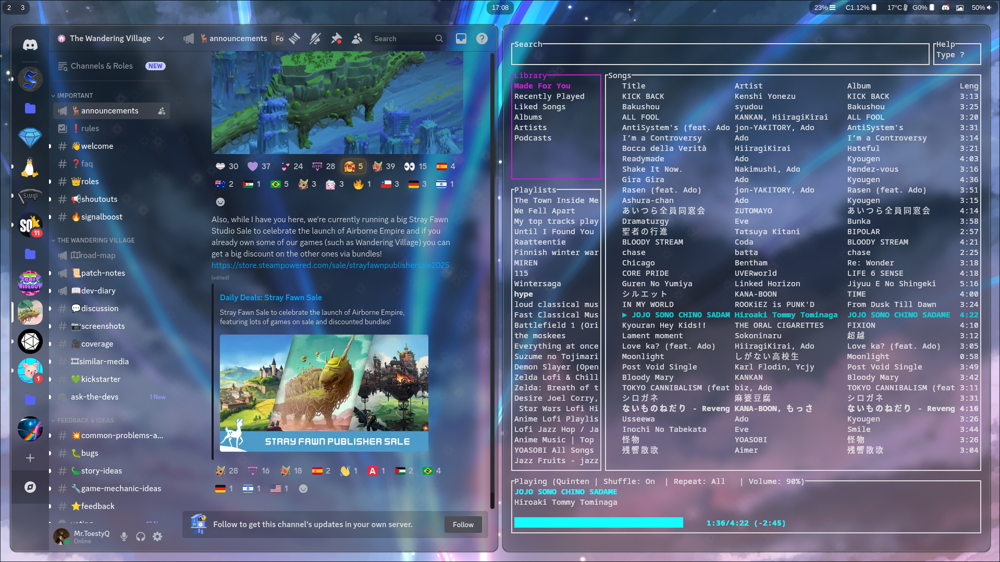

# Dotfiles
Hyprland linux Dotfiles 

thx to dpgraham4401's waybar config for ginving me a good start to make my own waybar config.
(https://github.com/dpgraham4401/.dotfiles/tree/fedora/sway/.config/waybar)

To use the dotfiles for your self copie and paste the files in to the proper config files on your system.

(!!Only tested on arch linux!!)
